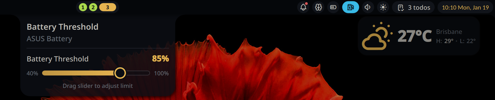

# Battery Threshold

A plugin for Noctalia Shell to control the battery threshold on laptops, helping extend battery lifespan. This plugin only works if your laptop supports charge threshold control (as exported by the kernel in sysfs). The plugin looks like this in action:



## Features

- **Bar Widget**: Shows current battery threshold in the bar
- **Panel**: Adjust battery threshold with a slider (40-100%)
- **Persistent Settings**: Saves and restores threshold across reboots

## Limitations

- Currently supports only the primary battery, which this plugin expects to
  have exposed as BAT0 by sysfs.

## Usage

Add the bar widget to your bar. Click to open the panel and adjust the battery threshold using the slider.

### Panel Controls

- Drag the slider to set battery threshold (40-100%)
- Changes are applied immediately
- Settings persist across reboots

## Setup (Required)

This plugin requires write access to the battery threshold sysfs file. The included `setup_rules.sh` script configures a udev rule that grants write permission to members of the `battery_ctl` group:

```bash
$ sudo ./setup_rules.sh
```

This script will:

- Create a `battery_ctl` group (if it doesn't exist)
- Add your user to the `battery_ctl` group
- Install the udev rule to `/etc/udev/rules.d/`
- Reload udev rules

**Note:** A reboot may be required for write access to take effect.

## IPC Commands

```bash
# Toggle panel
qs -c noctalia-shell ipc call plugin:battery-threshold togglePanel

# Set threshold
qs -c noctalia-shell ipc call plugin:battery-threshold set <value>
```

## Troubleshooting

- **Read-only mode**: Ensure udev rule is installed and you're in the correct group
- **Not available**: Your laptop may not support charge threshold control
- **Changes not saving**: Check write permissions on the sysfs file

## Requirements

- Laptop with battery charge threshold support (ThinkPad, ASUS, etc.)
- Noctalia 3.6.0 or later
- Tested on Asus Zenbook 14 UX3405
